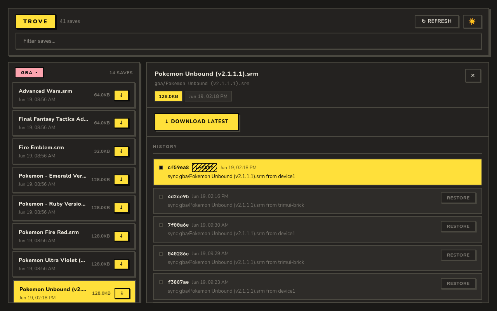

Self-hosted save-file sync and ROM trading for Anbernic and TrimUI handhelds. Runs on NixOS,
stores saves in a git working tree, and serves a web UI for browsing, restoring history, and
copying ROMs between devices on your local network. There is no authentication - this is intended
for personal use on a trusted LAN.

> **trove v0.4.5** - early development; unstable, APIs may change. Use at your own risk. Trove facilitates ROM transfers between devices on local networks and does not host ROMs.

---

## NixOS setup

Add trove as a flake input:

```nix
inputs.trove = {
  url = "github:CRBroughton/trove";
  inputs.nixpkgs.follows = "nixpkgs";
};
```

Import the module and enable the service:

```nix
imports = [ inputs.trove.nixosModules.default ];

services.trove = {
  enable      = true;
  openFirewall = true;   # exposes port on LAN
  port        = 8080;    # default; change if taken
};
```

```sh
sudo nixos-rebuild switch --flake .#hostname
systemctl status trove
```

---

## Anbernic (AmberELEC)

AmberELEC uses EmulationStation event scripts. Two hook files call `sync.sh`
on game start (pull) and game end (push).

### 1. Copy the sync script

```sh
scp nix/sync-client.sh root@DEVICE_IP:/storage/.config/trove/sync.sh
ssh root@DEVICE_IP "chmod +x /storage/.config/trove/sync.sh"
```

### 2. Edit the config at the top of `sync.sh`

```sh
SERVER="http://192.168.x.x:8080"   # LAN IP of your trove server
DEVICE_NAME="anbernic"              # unique name for this device
SAVES_DIR="/storage/roms"           # AmberELEC saves alongside ROMs, not in a subdirectory
ROMS_DIR="/storage/roms"            # ROM root for trading (set to "" to disable)
```

### 3. Create the event hooks

```sh
mkdir -p /storage/.config/emulationstation/scripts/game-start
mkdir -p /storage/.config/emulationstation/scripts/game-end
```

`/storage/.config/emulationstation/scripts/game-start/trove.sh`:
```sh
#!/bin/bash
/storage/.config/trove/sync.sh pull
```

`/storage/.config/emulationstation/scripts/game-end/trove.sh`:
```sh
#!/bin/bash
/storage/.config/trove/sync.sh push
```

```sh
chmod +x /storage/.config/emulationstation/scripts/game-start/trove.sh \
         /storage/.config/emulationstation/scripts/game-end/trove.sh
```

### 4. Add Trove Trade to Tools

AmberELEC resets `/storage/.config/distribution/modules/` on every boot. Copy the install script and wire it into `custom_start.sh` so the entry is recreated automatically:

```sh
scp nix/amberelec-install-tool.sh root@DEVICE_IP:/storage/.config/trove/install-tool.sh
ssh root@DEVICE_IP "chmod +x /storage/.config/trove/install-tool.sh"
```

Add to the `"before"` case in `/storage/.config/custom_start.sh`:

```sh
/storage/.config/trove/install-tool.sh
```

Run it once now to create the entry immediately:

```sh
/storage/.config/trove/install-tool.sh
```

Appears under Tools in EmulationStation. Launch it when you want to trade ROMs.

### 5. Test manually

```sh
/storage/.config/trove/sync.sh pull
/storage/.config/trove/sync.sh push
/storage/.config/trove/sync.sh trade
```

---

## TrimUI Brick (Batocera / Knulli)

Batocera calls a single dispatcher script with the event name as `$1` rather
than separate hook directories. Two files are needed under
`/userdata/system/scripts/trove/`.

### 1. Copy the sync script

```sh
scp nix/sync-client.sh root@DEVICE_IP:/userdata/system/scripts/trove/sync.sh
ssh root@DEVICE_IP "chmod +x /userdata/system/scripts/trove/sync.sh"
```

### 2. Edit the config at the top of `sync.sh`

```sh
SERVER="http://192.168.x.x:8080"   # LAN IP of your trove server
DEVICE_NAME="brick"                 # unique name for this device
SAVES_DIR="/userdata/saves"         # Batocera/Knulli saves directory
ROMS_DIR="/userdata/roms"           # ROM root for trading (set to "" to disable)
```

### 3. Create the event dispatcher

`/userdata/system/scripts/trove/trove`:
```sh
#!/bin/bash
SYNC=/userdata/system/scripts/trove/sync.sh
case "$1" in
  gameStart|gameLaunch) exec "$SYNC" pull ;;
  gameStop|gameEnd)     exec "$SYNC" push ;;
esac
```

```sh
chmod +x /userdata/system/scripts/trove/trove
```

Batocera discovers any executable in `/userdata/system/scripts/<name>/` and
calls it with events like `gameStart` and `gameStop`. The dispatcher maps
these to push and pull on `sync.sh`.

### 4. Add Trove Trade to Ports

```sh
mkdir -p /userdata/roms/ports
cat > "/userdata/roms/ports/Trove Trade.sh" << 'EOF'
#!/bin/bash
/userdata/system/scripts/trove/sync.sh trade
EOF
chmod +x "/userdata/roms/ports/Trove Trade.sh"
```

Appears under Ports in EmulationStation. Launch it when you want to trade ROMs.

### 5. Test manually

```sh
/userdata/system/scripts/trove/sync.sh pull
/userdata/system/scripts/trove/sync.sh push
/userdata/system/scripts/trove/sync.sh trade
```

---

## ROM Trading

The ⇌ TRADE tab in the web UI shows all devices on your local network. Select a ROM from one device and hit SEND to copy it to another. Trove facilitates ROM transfers between devices on your local network and does not host ROMs. ROMs are held in a temp file only while in-flight and deleted after delivery.

To trade, launch **Trove Trade** from EmulationStation on both devices (set up in the device sections above). This runs `sync.sh trade` which announces the device's ROM library to the server and processes any pending transfers. Both devices must announce before they appear in the TRADE tab.

---

## API

### Saves

| Method | Path | Description |
|--------|------|-------------|
| GET | `/api/files` | List all tracked saves |
| POST | `/api/push/<path>?device=<name>` | Upload a save |
| GET | `/api/pull/<path>` | Download the latest save |
| GET | `/api/history/<path>` | Git commit log for a save |
| POST | `/api/restore/<path>?hash=<sha>` | Restore to a previous commit |

```sh
curl -X POST --data-binary @pokemon.srm \
  http://192.168.x.x:8080/api/push/gba/pokemon.srm?device=anbernic

curl http://192.168.x.x:8080/api/pull/gba/pokemon.srm -o pokemon.srm
```

### Trading

| Method | Path | Description |
|--------|------|-------------|
| POST | `/api/trade/announce` | Register device with ROM list |
| GET | `/api/trade/devices` | List online devices and their ROMs |
| POST | `/api/trade/transfer` | Queue a ROM transfer between two devices |
| GET | `/api/trade/pending?device=<name>` | Check pending uploads/downloads for a device |
| POST | `/api/trade/upload/<path>?transfer=<id>` | Source device uploads ROM to server |
| GET | `/api/trade/fetch/<path>?transfer=<id>&device=<name>` | Target device downloads ROM from server |
| GET | `/api/trade/events` | SSE stream for live UI updates |

---

## Docker

```sh
docker compose up -d --build
docker compose logs -f
```

Save data persists in the `trove-data` volume across rebuilds. Point `SERVER`
in your client script at the Docker host's IP.

---

## Building locally

```sh
pnpm install
pnpm -F trove-ui build
go build -o trove ./cmd/trove
./trove -repo /tmp/test-saves -addr :8080
```
